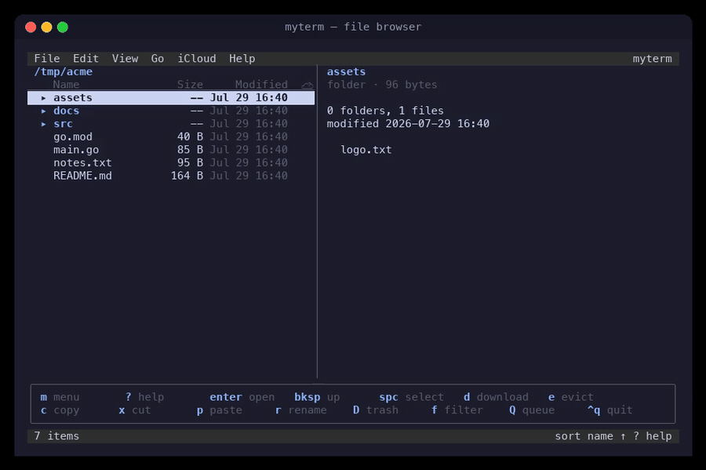
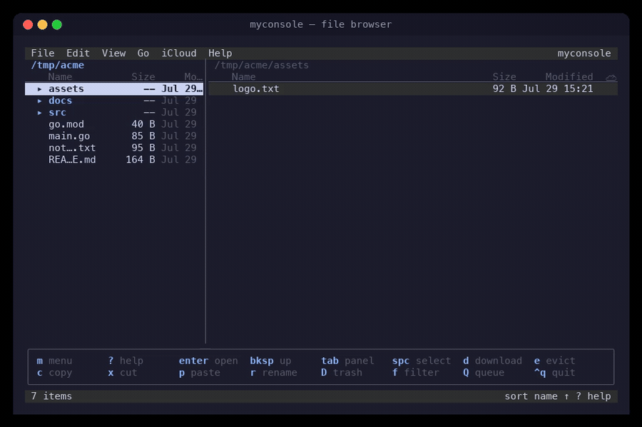

# MyTerm & MyConsole

**Two keyboard-driven terminal file browsers for macOS with first-class iCloud Drive support**, built from one shared foundation (Go + [Bubble Tea](https://github.com/charmbracelet/bubbletea), single binaries):

- **myterm** (`myterm-src/`) — *explorer style*: folders expand in place as a tree (`enter` toggles `▸`/`▾`, Windows-Explorer/nvim-tree style) with a detail panel on the right showing the selected item's contents and metadata.
- **myconsole** (`myconsole-src/`) — *Windows Explorer style*: `→` expands a folder in place (+ → −), `←` collapses, and a **focusable contents panel** on the right follows the selection (`tab` moves focus into it).

Both show which files are **evicted** (cloud-only ☁), **download** marked files/folders with a live progress queue, **evict** local copies to reclaim disk, and offer Finder-parity file management — the things Finder does with a right-click, minus the mouse.

## Demos

**myterm** — browsing, expanding the tree in place, the detail panel following the cursor, **dual independent panels** (`→` opens a folder in its own panel), filtering, menus, sort, Get Info, and the keyboard-reference overlay:



**myconsole** — the same in-place tree and detail panel, live filtering, menus, sort, help, and the **embedded vim-style editor**:



*(Both generated headlessly from the real UI — see [_demo/README.md](_demo/README.md) to regenerate. mydb, the database admin sibling, has its own demo in [README-mydb.md](README-mydb.md).)*


*myterm above; myconsole below — same folder, navigator style:*


---

## Contents

- [Choosing an app](#choosing-an-app)
- [Installation](#installation)
- [Quick start](#quick-start)
- [The interface](#the-interface)
- [Working with iCloud Drive](#working-with-icloud-drive)
- [File management](#file-management)
- [Finding files](#finding-files)
- [Keyboard reference](#keyboard-reference)
- [Configuration & themes](#configuration--themes)
- [Architecture](#architecture)
- [Development](#development)
- [Troubleshooting](#troubleshooting)

**Docs:** this README is the shared reference · [USAGE.md](USAGE.md) is the hands-on manual · [DEPLOY.md](DEPLOY.md) covers rebuild/install · [SPEC-myterm.md](SPEC-myterm.md) is the original design spec · [GETSTARTED.md](GETSTARTED.md) explains regenerating the screenshots.

---

## Choosing an app

Both are trees now — the difference is idiom:

| | **myterm** (nvim-tree idiom) | **myconsole** (Windows Explorer idiom) |
|---|---|---|
| Expand / collapse | `enter` toggles | `→` expands, `←` collapses (`enter` toggles too) |
| `→` on an expanded folder | Opens it as an independent dual panel | Steps to its first child |
| `←` on a nested row | Parent directory | Jumps to the parent *row* in the tree |
| Right side of the screen | **Passive** detail panel following the cursor | **Focusable** contents panel: `tab` moves focus in, navigate/select/operate there, `tab` (or `←`) back |
| Dual independent panels | Yes (`→`, `tab`, `ctrl+w`) | No — replaced by the contents panel (`ctrl+w`/`F3` toggle its visibility) |
| Everything else | Identical: iCloud queue, file ops, menus, search, themes, config format | Identical |

They are separate binaries with separate config (`~/.config/myterm/`, `~/.config/myconsole/`) and state, so you can run both side by side.

## Installation

Requires **Go 1.22+**. The two file browsers additionally need the **Xcode Command Line Tools** (the iCloud bridge uses cgo → Foundation); **mydb** is pure Go with no cgo. All three apps live in this repo, so clone it once:

```sh
git clone git@github.com:offsideAI/mytermtui.git
cd mytermtui
```

Then install any app on its own — or all three.

### myterm

```sh
cd myterm-src
go build -o myterm .
install myterm /opt/homebrew/bin/   # or sudo … /usr/local/bin/
cd ..
```

### myconsole

```sh
cd myconsole-src
go build -o myconsole .
install myconsole /opt/homebrew/bin/   # or sudo … /usr/local/bin/
cd ..
```

### mydb

A third sibling — a database admin TUI (SQLite + PostgreSQL) rather than a file browser. Pure Go, no cgo, no Full Disk Access; see [README-mydb.md](README-mydb.md).

```sh
cd mydb-src
go build -o mydb .
install mydb /opt/homebrew/bin/   # or sudo … /usr/local/bin/
cd ..
```

> **Full Disk Access required for iCloud browsing.** `~/Library/Mobile Documents` is protected; grant your terminal app Full Disk Access in *System Settings → Privacy & Security*. Without it the status bar shows a permission hint when you enter iCloud paths. (Applies to myterm/myconsole only — mydb never touches iCloud.)

Non-macOS builds compile and run as plain file browsers — iCloud actions report "requires macOS".

## Quick start

```sh
myterm                      # or myconsole — start in ~ (configurable)
myterm ~/some/dir
myterm --version
```

A 60-second tour (either app):

1. Press `i` to jump to the iCloud Drive root; navigate with arrows or `hjkl`.
2. In **myterm**, `enter` a folder to expand it in place and watch the right panel follow your cursor. In **myconsole**, `enter` steps into the folder (`backspace` back up).
3. Files marked `☁` exist only in the cloud. Press **`d`** on one — watch `◌` → `⇣` with a progress bar → `✓`. Press **`e`** on a `✓` file to evict it and reclaim the space.
4. `?` for the full key reference, `m` for menus, `ctrl+q` to quit.

## The interface

```
┌ menu bar ──────────────────────────────────────────────┐
│ breadcrumb (current path, ☁ when inside iCloud)        │
│ file list / tree · size · modified · iCloud status     │
│ …                                 detail/preview panel │
│ download bar (only while the queue is active)          │
│ boxed shortcut bar (nano-style, context-aware)         │
│ status bar: selection / messages · sort · hints        │
└─────────────────────────────────────────────────────────┘
```

- **Menu bar** — press `m` (or `F10`): File, Edit, View, Go, iCloud, Help. Every item shows its shortcut, so the menus double as a cheat sheet.

  

- **The tree (both apps)** — folders expand in place (`▾`/`▸`), children indented, state surviving sorting, filtering, and background refreshes. Toggle with `enter` in both; in myconsole `→`/`←` are the Explorer-style expand/collapse keys (`←` also jumps from a nested row to its parent row, and re-roots at the parent directory from the top level).

- **The right panel** — sized by `split_ratio` (default 30/70), resized with `<`/`>`, toggled with `F3`. In **myterm** it is a passive detail view (folder contents + metadata, or file metadata + safe text preview). In **myconsole** it is a *focusable* contents panel: `tab` moves focus into it, everything works there (navigate, select, copy, trash, download), and `tab` or `←` returns to the tree — each side remembering its cursor and selection.

  

- **Embedded editor (myconsole)** — `enter` on a file opens it in a vim-style modal editor in the right panel: normal/insert/command/search modes, `hjkl`/`w`/`b`/`e`/`0`/`$`/`gg`/`G` motions with counts, `i`/`a`/`o`/`I`/`A`, `x`/`dd`/`dw`/`cc`/`cw`/`C`/`D`/`r`, `yy`/`p`, `u` + `ctrl-r` undo, `/`+`n`/`N` search, and `:w` `:q` `:wq` `:q!`. `tab` parks focus back on the tree (editor stays open); `:q` closes it. Evicted, binary, and >10 MB files are refused. A vim *subset*, not full vim — no `.vimrc` or plugins. Set `enter_opens_file = "reveal"` or `"app"` to keep the old behavior.

  

- **Dual panels (myterm only)** — `→` on a folder opens it as an independent right panel; `tab` switches focus, `ctrl+w` closes the split.

  

- **Shortcut bar** — nano-style boxed cheat sheet above the status line; context-aware and always showing your live bindings. Toggle with `H`.

- **Status bar** — selection count and size, item count, operation results, sort order.

## Working with iCloud Drive

*(Identical in both apps.)*

### How macOS represents evicted files (and why these tools exist)

On modern macOS (FileProvider-based iCloud Drive), an evicted file is a *dataless* file: it keeps its name and full logical size, but occupies **zero blocks** on disk and carries the `SF_DATALESS` stat flag. There are no `.icloud` placeholder files anymore, and the old `brctl download` / `brctl evict` commands were removed. So the apps:

- detect evicted files with one `lstat` (`st_flags & SF_DATALESS`);
- start downloads with `NSFileManager startDownloadingUbiquitousItemAtURL:` and evict with `evictUbiquitousItemAtURL:` (a small cgo bridge);
- read live percentages by polling Apple's entitled `brctl status` (fileproviderd stages downloads out of view — blocks appear only at completion — and hides its progress from non-entitled processes, so `brctl` is the one accessible source; updates can lag ~20s while the daemon is busy).

### The status column

| Glyph | Meaning |
|:---:|---|
| `✓` (green) | Local and synced |
| `☁` (blue) | Evicted — exists only in iCloud |
| `◌` (dim) | Marked for download, waiting in the queue |
| `⇣` (yellow) | Downloading now |
| `◌` / `⇣` on a folder | Contents of that folder are queued / downloading |
| `·` | Folder inside iCloud, nothing in flight (contents not scanned) |
| *(blank)* | Outside iCloud |

### Downloading

Select files or folders (folders are expanded recursively — listings only, nothing is read) and press **`d`**. The queue starts up to `max_concurrent_downloads` materializations at once and shows an aggregate progress bar. Press **`Q`** for the queue manager: `c` cancel item (partial downloads are evicted again), `C` cancel all, `p` pause, `K`/`J` reorder, `x` clear finished.

The queue persists (`~/.local/state/<app>/queue.json`) — quit mid-download and pending marks resume on the next launch (the transfer itself continues in `fileproviderd` either way).

### Evicting

Press **`e`** on local iCloud items, confirm, and the local bytes are released. The file remains in iCloud showing `☁`.

### The no-accidental-download guarantee

Reading a dataless file's *contents* triggers a download — so a naive file manager can pull gigabytes just by previewing. Every content-reading path is guarded:

- The **detail/preview panel** reads files on a thread with `IOPOL_TYPE_VFS_MATERIALIZE_DATALESS_FILES = OFF`, so an evicted file can never materialize from browsing:

  

- **Quick Look** and **Open With** refuse evicted files and point you to `d`.
- **Copy/paste** and **Compress** count the cloud-only bytes involved and ask for confirmation before proceeding.

### Folder summary

Press **`S`** to tally a folder: local vs cloud-only file counts and byte totals.

## File management

*(Identical in both apps; in myterm, operations also work on rows inside expanded subtrees.)*

All operations act on the **selection** (`space` toggle, `v` range, `a` all) or, with nothing selected, the cursor item.

- **Copy / Cut / Paste** — `c` / `x` / `p`. Name conflicts offer *keep both* / *replace* / *skip*; replace moves the old file to the **Trash** (recoverable). APFS copies are instant clones; cross-volume copies stream with progress and preserve permissions, times, xattrs.
- **Trash** — `D`, into the real macOS Trash with Finder "Put Back"; **undo** (`u`) restores.
- **Create / rename / duplicate** — `n` folder, `N` file, `r` rename, `ctrl+d` duplicate.
- **Compress** — `Z` zips the selection (`ditto`, Finder-compatible).
- **Inspect** — `I` Get Info (kind, logical vs on-disk size, permissions, iCloud state):

  

- **Hand off to macOS** — `enter` on a file reveals it in Finder (`enter_opens_file = "app"` opens it instead); `o` always opens in the default app; `q` Quick Look; `O` open with a named app; `R` reveal; `T` Terminal here; `.` copy path.

## Finding files

- **Filter** (`f`) — narrows the listing live as you type; in myterm the filter applies at every expanded level. `enter` keeps it, `esc` clears.

  

- **Fuzzy find** (`F`) — recursive subsequence search under the current root; `enter` jumps to the hit.
- **Go to path** (`:`) — with tab completion; `~` expands.
- **Sort** (`s`), **hidden files** (`z`), **history** `[` / `]`.

## Keyboard reference

Press `?` in either app for the live version (it reflects your remaps):


| Group | Keys |
|---|---|
| **Move** | `↑↓`/`kj` cursor · `enter` expand/collapse folder, reveal file · `bksp` parent directory · `g`/`G` top/bottom · `pgup`/`pgdn` page |
| **Tree** | myconsole: `→` expand / first child · `←` collapse / parent row / parent dir · myterm: `enter` toggles, `←`/`h` parent |
| **Panels** | `tab` switch focus · `<`/`>` resize · `ctrl+w`/`F3` toggle panel · myterm only: `→`/`l` open folder as dual panel |
| **Go** | `[` `]` history · `~` home · `/` root · `i` iCloud Drive · `:` go to path |
| **View** | `z` hidden · `s` sort · `f` filter · `F` fuzzy find · `H` shortcut bar · `ctrl+r` refresh |
| **Select** | `space` toggle · `v` range · `a` all · `A`/`esc` clear |
| **Files** | `o` open in app · `c` copy · `x` cut · `p` paste · `r` rename · `D` trash · `ctrl+d` duplicate · `n`/`N` new · `u` undo · `O` open with · `q` Quick Look · `I` info · `Z` zip · `R` reveal · `T` terminal · `.` copy path |
| **iCloud** | `d` download · `e` evict · `Q` queue · `S` summary |
| **App** | `m`/`F10` menus · `?`/`F1` help · `ctrl+q` quit |

## Configuration & themes

Each app reads its own file — `~/.config/myterm/config.toml` or `~/.config/myconsole/config.toml`:

```toml
[general]
start_dir     = "~"
show_hidden   = false
confirm_trash = true
dirs_first    = true
show_hints    = true         # nano-style shortcut bar
show_preview  = true         # right panel on launch (detail/contents)
split_ratio   = 0.30         # left share: panel split & myterm's list/detail divide
enter_opens_file = "editor"  # enter on a file: "editor" | "reveal" in Finder | "app"

[icloud]
max_concurrent_downloads = 3
poll_interval_ms         = 500

[theme]
name = "default"             # default | dracula | solarized

[keys]                       # action = [keys…] — see <app>-src/internal/ui/keys.go
download = ["d"]
quit     = ["ctrl+q"]
```


*(Migrating from the single-app era: copy `~/.config/mytermtui/config.toml` to the new per-app paths.)*

## Architecture

Two sibling Go modules sharing one lineage — `myterm-src/` adds the tree/detail layer on top of the common core:

```
myterm-src/ · myconsole-src/    each a full Go module
  main.go                       flags, config, wiring
  internal/ui/                  Bubble Tea Elm-architecture model
    model.go                    state, messages, update loop (never touches disk)
    panes.go                    dual-panel state (park/restore/swap)
    actions.go, render.go, …    actions, views, menus, dialogs, keys, theming
  internal/fsx/                 listing, sorting, fuzzy find, copy/move/zip engine
  internal/icloud/              dataless detection, cgo Foundation bridge,
                                brctl progress parser, download queue (persisted)
  internal/config/              TOML config
  cmd/screenshot/               headless frame dumper for the docs
scripts/ansi2png.py             shared ANSI frame → PNG renderer
screenshots/ (+ myconsole/)     generated UI screenshots per app
```

Design notes: the update loop is pure state (all I/O in commands); the download queue is tick-driven and testable with a fake bridge; one mutating filesystem operation runs at a time, which keeps single-level undo sound; in myterm the visible tree is flattened from a root listing plus cached child listings on every rebuild.

## Development

```sh
cd myterm-src      # or myconsole-src
go test ./... && go vet ./...
```

Regenerate screenshots (see [GETSTARTED.md](GETSTARTED.md) for details):

```sh
go -C myterm-src    run ./cmd/screenshot -dir "<folder>" -filter md -out ../screenshots/ansi
python3 scripts/ansi2png.py screenshots/ansi screenshots myterm

go -C myconsole-src run ./cmd/screenshot -dir "<folder>" -filter md -out ../screenshots/ansi
python3 scripts/ansi2png.py screenshots/ansi screenshots/myconsole myconsole
```

Manual iCloud acceptance checklist (needs a signed-in account): evicted rows show `☁` → preview one (no download happens) → `d` downloads with `◌ → ⇣ → ✓` and a live percentage → `e` evicts back to `☁` → quit mid-download and relaunch resumes the queue.

## Troubleshooting

| Symptom | Fix |
|---|---|
| "operation not permitted" under `~/Library/Mobile Documents` | Grant your terminal Full Disk Access, restart the terminal |
| `F10` opens Mission Control | Hold `fn`, or use `m` |
| Download percentage takes ~20s to move | Normal: `brctl` answers slowly while fileproviderd is busy; the bar never regresses |
| Downloads sit at `stalled` | Network/quota issue on Apple's side; retries as soon as bytes move |
| Glyph still `☁` after a download | Refreshes on the next tick; `ctrl+r` forces it |
| Colors look flat | Use a true-color terminal; the `default` theme adapts to 256-color |
| Old `~/.config/mytermtui` settings ignored | Copy them to `~/.config/myterm/` and/or `~/.config/myconsole/` |
