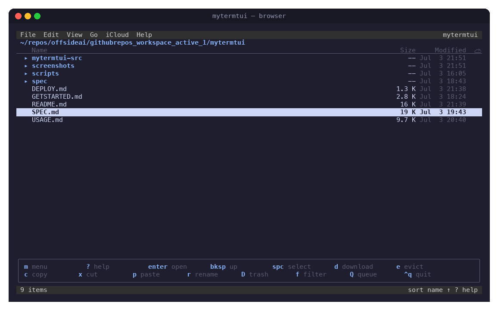
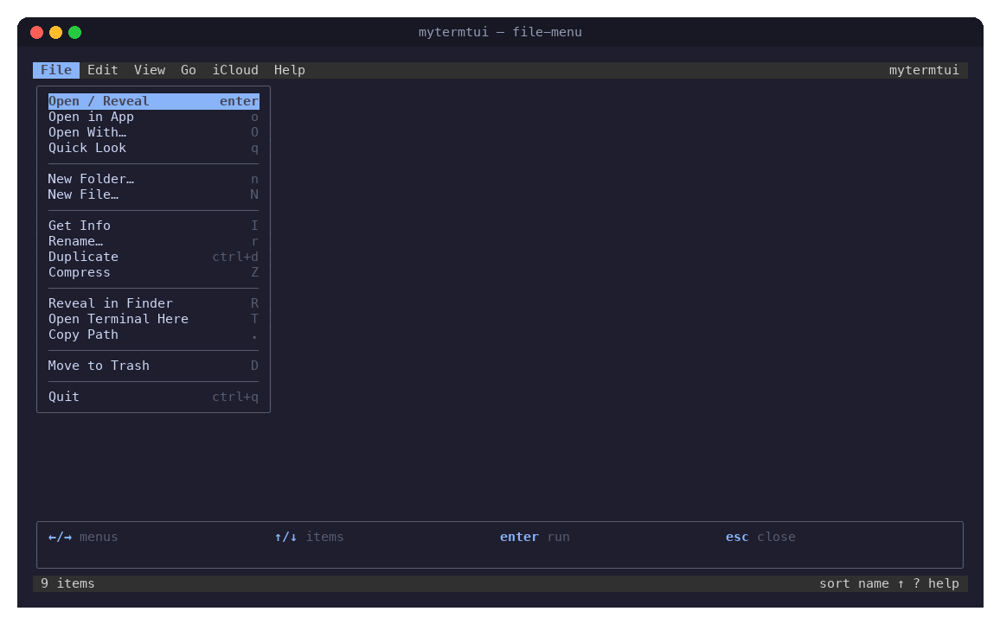
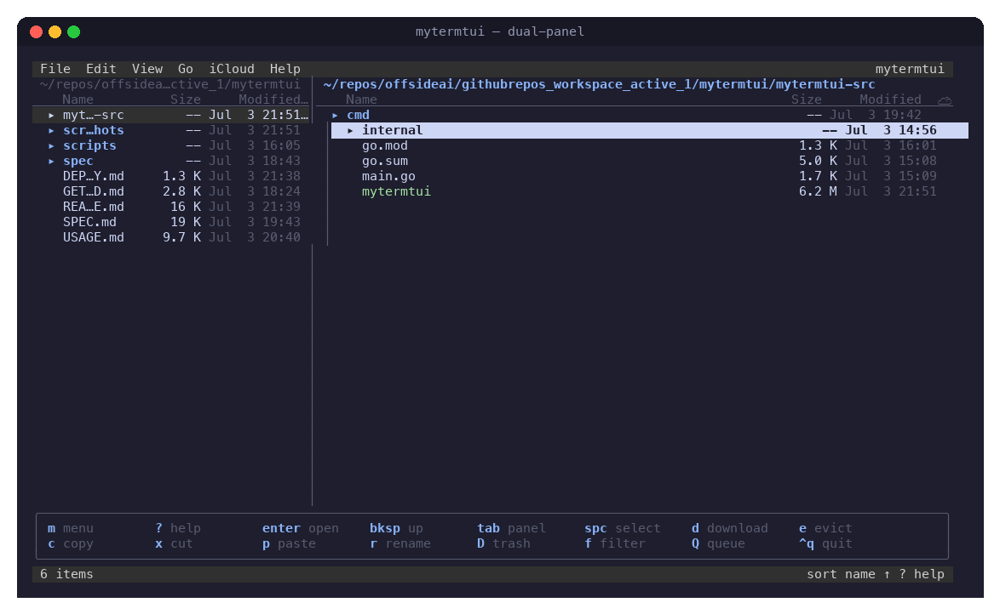
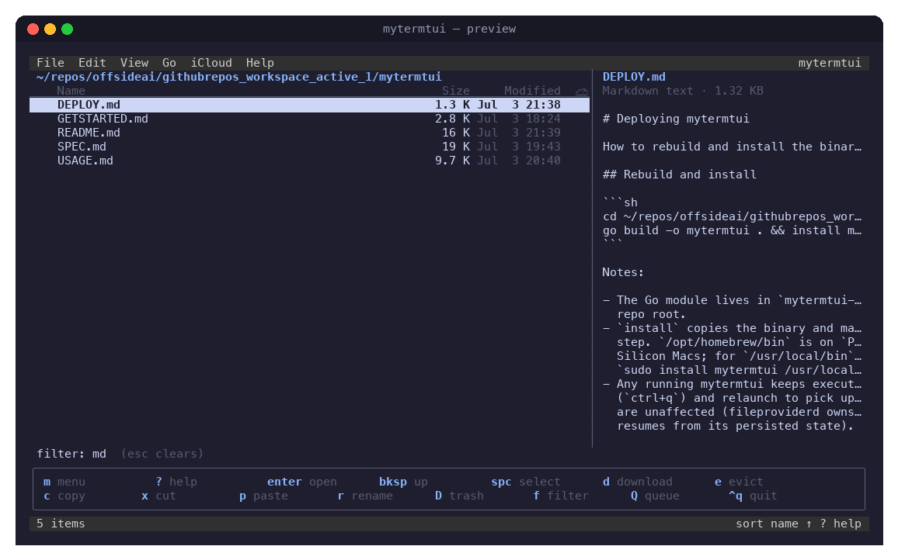
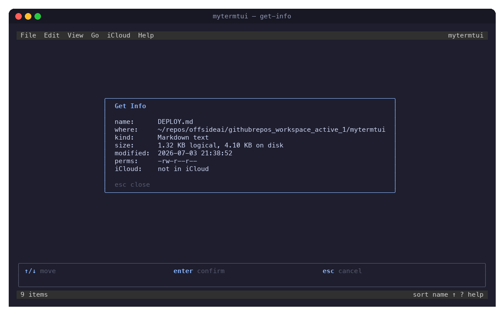
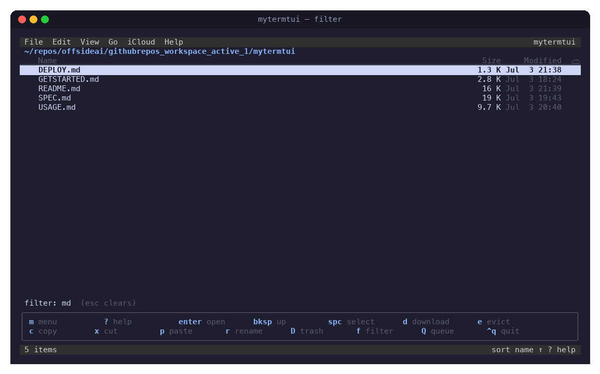
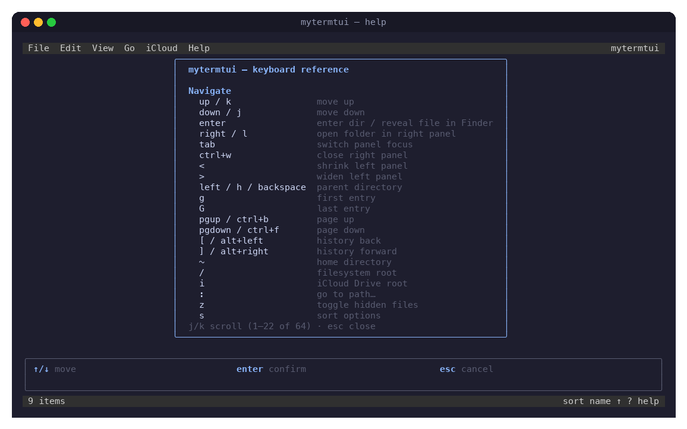
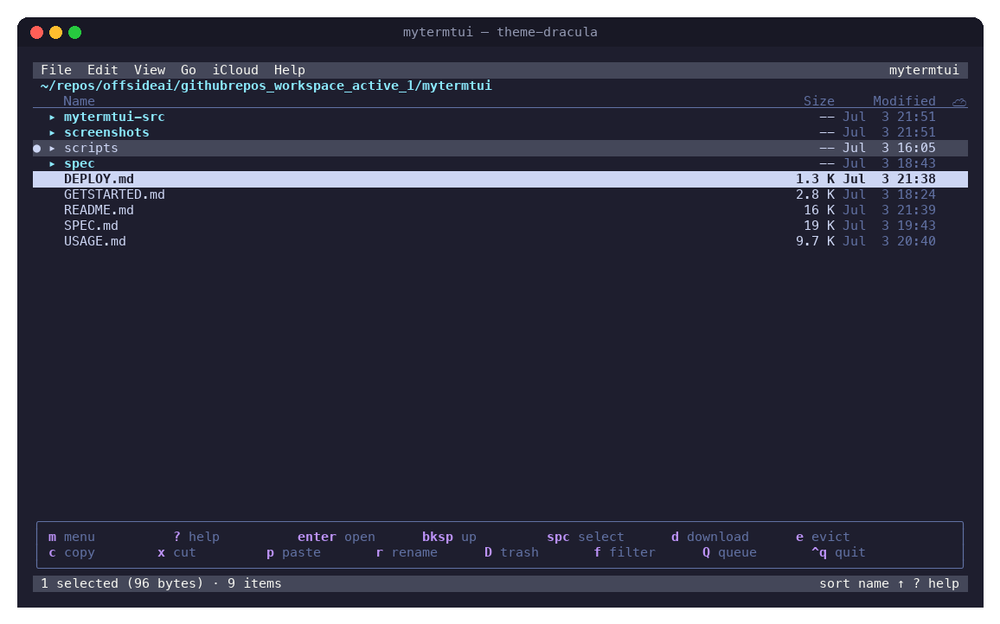

# MyTermTUI

**A keyboard-driven terminal file browser for macOS with first-class iCloud Drive support.**

`mytermtui` shows which files are **evicted** (cloud-only ☁), lets you **mark files and folders for download** with a live progress queue, and can **evict** local copies back to the cloud — the things Finder does with a right-click, minus the mouse. Around that it is a full file manager: copy, move, trash, rename, preview, search, menus — all from the keyboard.

Built with Go + [Bubble Tea](https://github.com/charmbracelet/bubbletea). Ships as a single binary.

**Docs:** this README covers installation, concepts, and reference · [USAGE.md](USAGE.md) is the hands-on user manual · [DEPLOY.md](DEPLOY.md) covers rebuild/install · [SPEC.md](SPEC.md) is the original design spec · [GETSTARTED.md](GETSTARTED.md) explains regenerating the screenshots.



---

## Contents

- [Features](#features)
- [Installation](#installation)
- [Quick start](#quick-start)
- [The interface](#the-interface)
- [Working with iCloud Drive](#working-with-icloud-drive)
- [File management](#file-management)
- [Finding files](#finding-files)
- [Keyboard reference](#keyboard-reference)
- [Configuration & themes](#configuration--themes)
- [Architecture](#architecture)
- [Development](#development)
- [Troubleshooting](#troubleshooting)

---

## Features

| | |
|---|---|
| **iCloud status at a glance** | `✓` local · `☁` cloud-only · `◌` queued · `⇣` downloading, per file, from a single `lstat` |
| **Download queue** | Mark any files/folders with `d`; concurrent downloads with live progress, pause, reorder, cancel; persists across restarts |
| **Evict** | Free disk space with `e` — the file stays in iCloud and returns to `☁` |
| **No accidental downloads** | Previews and browsing can never materialize an evicted file; operations that would (copy, compress) ask first |
| **Finder-parity file ops** | Copy/cut/paste with conflict dialog, rename, duplicate, native recoverable Trash, new file/folder, compress, Quick Look, Get Info, reveal in Finder, undo |
| **Fast navigation** | Vim keys *and* arrow keys, history back/forward, go-to-path with tab completion, per-directory filter, recursive fuzzy find |
| **Dual panels** | `→` opens a folder in a right panel (resizable split); `tab` switches focus, each panel keeping its own cursor and selection |
| **Discoverable UI** | Pull-down menus, nano-style shortcut bar, searchable help overlay — no memorization required |
| **Configurable** | TOML config: rebind every key, three color themes, tuning knobs |

## Installation

Requires **Go 1.22+** and the **Xcode Command Line Tools** (the iCloud bridge uses cgo → Foundation).

```sh
git clone git@github.com:offsideAI/mytermtui.git
cd mytermtui/mytermtui-src
go build -o mytermtui .
```

Optionally move the binary onto your `PATH`:

```sh
install mytermtui /usr/local/bin/
```

> **Full Disk Access required for iCloud browsing.** `~/Library/Mobile Documents` is protected; grant your terminal app Full Disk Access in *System Settings → Privacy & Security → Full Disk Access*. Without it the status bar shows a permission hint when you enter iCloud paths.

Non-macOS builds compile and run as a plain file browser — iCloud actions report "requires macOS".

## Quick start

```sh
./mytermtui                  # start in ~ (configurable)
./mytermtui ~/some/dir       # start elsewhere
./mytermtui --version
```

A 60-second tour:

1. Press `i` to jump to the iCloud Drive root, navigate with arrows or `hjkl`, `enter` to open a folder.
2. Files marked `☁` exist only in the cloud. Put the cursor on one and press **`d`** — watch `◌` → `⇣` with a progress bar → `✓`.
3. Press **`e`** on a `✓` file to evict it and reclaim the disk space.
4. Press `?` for the full key reference, `m` for menus, `ctrl+q` to quit.

## The interface

```
┌ menu bar ──────────────────────────────────────────────┐
│ breadcrumb (current path, ☁ when inside iCloud)        │
│ file list: selection · name · size · modified · iCloud │
│ …                                        preview panel │
│ download bar (only while the queue is active)          │
│ boxed shortcut bar (nano-style, context-aware)         │
│ status bar: selection / messages · sort · hints        │
└─────────────────────────────────────────────────────────┘
```

- **Menu bar** — press `m` (or `F10`): File, Edit, View, Go, iCloud, Help. Navigate with arrows, run with `enter`. Every item shows its shortcut, so the menus double as a cheat sheet.

  

- **Shortcut bar** — the boxed, two-row hint bar above the status line. It is context-aware (switches while a menu, dialog, or the filter is active) and always shows your *live* bindings, so config remaps stay truthful. Toggle with `H`.

- **Preview panel** — `F3` (or `P`) splits the view. Text files show their head, folders show their contents, and evicted files show their cloud status *without downloading anything* (see below).

- **Status bar** — selection count and size, item count, transient results of operations, sort order.

- **Dual panels** — press `→` (or `l`) on a folder to open it in a right panel while the current listing docks left; `tab` switches focus (each panel keeps its own cursor, selection, filter, and history), `←` in the right panel steps back to the left one, `<`/`>` resize the split, `ctrl+w` closes it. The default split is 30/70 (`split_ratio` in config).

  

## Working with iCloud Drive

### How macOS represents evicted files (and why this tool exists)

On modern macOS (FileProvider-based iCloud Drive), an evicted file is a *dataless* file: it keeps its name and full logical size, but occupies **zero blocks** on disk and carries the `SF_DATALESS` stat flag. There are no `.icloud` placeholder files anymore, and the old `brctl download` / `brctl evict` commands were removed. `mytermtui` therefore:

- detects evicted files with one `lstat` (`st_flags & SF_DATALESS`);
- starts downloads with `NSFileManager startDownloadingUbiquitousItemAtURL:` and evicts with `evictUbiquitousItemAtURL:` (a small cgo bridge, `mytermtui-src/internal/icloud/bridge_darwin.go`);
- reads live percentages by polling Apple's entitled `brctl status`
  (fileproviderd stages downloads out of view — blocks appear only at
  completion — and hides its progress from non-entitled processes, so
  `brctl` is the one accessible source; updates can lag ~20s while the
  daemon is busy).

### The status column

| Glyph | Meaning |
|:---:|---|
| `✓` (green) | Local and synced |
| `☁` (blue) | Evicted — exists only in iCloud |
| `◌` (dim) | Marked for download, waiting in the queue |
| `⇣` (yellow) | Downloading now |
| `◌` / `⇣` on a folder | Contents of that folder are queued / downloading |
| `·` | Folder inside iCloud, nothing in flight (contents not scanned) |
| *(blank)* | Outside iCloud |

### Downloading

Select files or folders (folders are expanded recursively — listings only, nothing is read) and press **`d`**. The queue starts up to `max_concurrent_downloads` materializations at once and shows an aggregate progress bar. Press **`Q`** for the queue manager: `c` cancel item (partial downloads are evicted again), `C` cancel all, `p` pause, `K`/`J` reorder, `x` clear finished.

The queue is persisted to `~/.local/state/mytermtui/queue.json` — quit mid-download and pending marks resume on the next launch (the actual transfer continues in `fileproviderd` either way).

### Evicting

Press **`e`** on local iCloud items, confirm, and the local bytes are released. The file remains in iCloud showing `☁`.

### The no-accidental-download guarantee

Reading a dataless file's *contents* triggers a download — so a naive file manager can pull gigabytes just by previewing. `mytermtui` guards every content-reading path:

- The **preview panel** reads files on a thread with `IOPOL_TYPE_VFS_MATERIALIZE_DATALESS_FILES = OFF`, so an evicted file can never materialize from browsing. It shows the cloud status instead:

  

- **Quick Look** and **Open With** refuse evicted files and point you to `d`.
- **Copy/paste** and **Compress** count the cloud-only bytes involved (folders scanned via listings) and ask for confirmation before proceeding.

### Folder summary

Press **`S`** to tally a folder: how many files are local vs cloud-only and how many bytes each way — useful before a bulk download or evict.

## File management

All operations act on the **selection** (space to toggle, `v` for a range, `a` all) or, with nothing selected, the cursor item.

- **Copy / Cut / Paste** — `c` / `x` / `p` (app-internal clipboard). Name conflicts open a dialog: *keep both* (Finder-style `name 2.ext`), *replace*, or *skip*. Replace moves the old file to the **Trash**, not oblivion. On APFS, copies use `clonefile(2)` — instant and copy-on-write — falling back to a streaming copy with progress that preserves permissions, times, and xattrs.
- **Trash** — `D` uses macOS's real Trash (`trashItemAtURL`), so items are recoverable in Finder, and **undo** (`u`) puts them back.
- **Undo** — `u` reverses the last operation: rename, move, copy, trash, duplicate, compress, new file/folder (single level).
- **Get Info** — `I`:

  

- **More** — duplicate (`ctrl+d`), new folder/file (`n`/`N`), compress to zip (`Z`, uses `ditto` to preserve resource forks), Quick Look (`q`), open with a specific app (`O`), reveal in Finder (`R`), open Terminal here (`T`), copy path to clipboard (`.`).

Filenames are handled as opaque bytes throughout — names with exotic Unicode (macOS screen recordings contain a narrow no-break space before "PM") sort, render, and operate correctly.

## Finding files

- **Filter** (`f`) — type to narrow the current directory live; `enter` keeps the filter, `esc` clears it.
- **Fuzzy find** (`F`) — recursive, subsequence-matched search under the current directory; `enter` jumps to the result.



- **Go to path** (`:`) — type any path with tab completion; `~` expands.
- **History** — `[` / `]` (or `alt+←`/`alt+→`) move back and forward; `backspace` goes to the parent with the cursor on the folder you came from.

## Keyboard reference

Press `?` in the app for the always-current version of this table (it reflects your remaps):



Defaults:

| Group | Keys |
|---|---|
| **Move** | `↑↓`/`kj` cursor · `enter` open dir / reveal file in Finder · `←`/`h`/`bksp` parent · `g`/`G` top/bottom · `pgup`/`pgdn` page |
| **Panels** | `→`/`l` open folder in right panel · `tab` switch focus · `←` (right panel) back to left · `<`/`>` resize · `ctrl+w` close |
| **Go** | `[` `]` history · `~` home · `/` root · `i` iCloud Drive · `:` go to path |
| **View** | `z` hidden files · `s` sort · `f` filter · `F` fuzzy find · `F3`/`P` preview · `H` shortcut bar · `ctrl+r` refresh |
| **Select** | `space` toggle · `v` range · `a` all · `A`/`esc` clear |
| **Files** | `c` copy · `x` cut · `p` paste · `r`/`F2` rename · `D`/`F8` trash · `ctrl+d` duplicate · `n` folder · `N` file · `u` undo |
| **Open/Info** | `o` open in default app · `O` open with · `q` Quick Look · `I` get info · `Z` compress · `R` reveal · `T` terminal · `.` copy path |
| **iCloud** | `d` download · `e` evict · `Q` queue manager · `S` folder summary |
| **App** | `m`/`F10` menus · `?`/`F1` help · `ctrl+q` quit |

## Configuration & themes

Everything is optional. Create `~/.config/mytermtui/config.toml`:

```toml
[general]
start_dir     = "~"        # initial directory
show_hidden   = false      # dotfiles + Finder-hidden
confirm_trash = true       # ask before moving to Trash
dirs_first    = true       # folders sort above files
show_hints    = true       # nano-style shortcut bar

[icloud]
max_concurrent_downloads = 3
poll_interval_ms         = 500   # progress poll cadence

[theme]
name = "default"           # default | dracula | solarized

[keys]                     # action = [keys…] — see mytermtui-src/internal/ui/keys.go
download = ["d"]
quit     = ["ctrl+q"]
```

`default` leans on your terminal's own palette; `dracula` and `solarized` bring their own colors:



Every action in [`mytermtui-src/internal/ui/keys.go`](mytermtui-src/internal/ui/keys.go) can be rebound by its name (`download`, `toggle_hidden`, `fuzzy_find`, …). The shortcut bar, menus, and help overlay all display whatever you bind.

## Architecture

```
mytermtui-src/            the Go module
  main.go                 flags, config, wiring, tea.NewProgram
  internal/ui/            Bubble Tea Elm-architecture model
    model.go              state, messages, update loop (never touches disk)
    actions.go            every user action; ops run in commands
    render.go, hints.go   views: list, bars, menus, shortcut box
    modals.go, menu.go    dialogs and pull-down menus
    keys.go, theme.go     bindings and styling
  internal/fsx/           listing, sorting, fuzzy find, copy/move/zip engine
  internal/icloud/        dataless detection, cgo Foundation bridge,
                          download queue (poll-driven, persisted)
  internal/config/        TOML config
  cmd/screenshot/         headless frame dumper for the docs
scripts/ansi2png.py       ANSI frame → PNG renderer
screenshots/              generated UI screenshots (see Development)
```

Design notes:

- The update loop is pure state; directory reads, file operations, downloads, and previews run as Bubble Tea commands in goroutines and come back as messages.
- The download queue has **no internal goroutine**: the UI ticks it at `poll_interval_ms`, which makes it deterministic and easily testable (the tests drive it with a fake bridge and fake clock).
- Only one mutating filesystem operation runs at a time (enforced centrally in the action dispatcher), which is what makes single-level undo sound.

## Development

```sh
cd mytermtui-src
go test ./...     # unit + UI tests (queue uses a fake bridge; no iCloud needed)
go vet ./...
gofmt -l .
```

Regenerate the screenshots after UI changes (they are rendered from the real model, headlessly — no terminal capture):

```sh
# from the repo root:
go -C mytermtui-src run ./cmd/screenshot -dir "<folder to show>" -out ../screenshots/ansi
python3 scripts/ansi2png.py screenshots/ansi screenshots   # needs Pillow
```

Manual iCloud acceptance checklist (needs a signed-in iCloud account):

1. Open an iCloud folder with evicted files → rows show `☁`.
2. Preview (`F3`) an evicted file → shows "cloud-only", does **not** download it.
3. `d` on a `☁` file → `◌` → `⇣` with progress → `✓`.
4. `e` on the `✓` file → confirm → back to `☁` (verify with `stat -f "blocks=%b"`).
5. Quit mid-download and relaunch → queue resumes from persisted state.

## Troubleshooting

| Symptom | Fix |
|---|---|
| "operation not permitted" browsing `~/Library/Mobile Documents` | Grant your terminal Full Disk Access (System Settings → Privacy & Security) and restart the terminal |
| `F10` opens Mission Control instead of the menus | Hold `fn`, or just press `m`; or enable "Use F1, F2, etc. as standard function keys" |
| Downloads sit at `stalled` | Network/quota issue on Apple's side — check iCloud status in System Settings; the item retries as soon as bytes move |
| A download finished but the glyph is still `☁` | The list refreshes on the next tick; `ctrl+r` forces it |
| Colors look flat | Use a true-color terminal (`echo $COLORTERM` → `truecolor`); the `default` theme also adapts to 256-color terminals |
| Quit during a download — is it lost? | No: `fileproviderd` keeps transferring; relaunching resumes progress tracking from the persisted queue |
